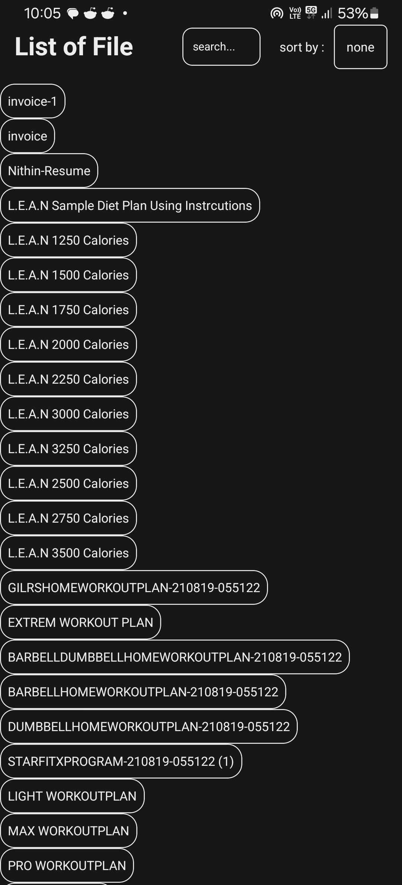
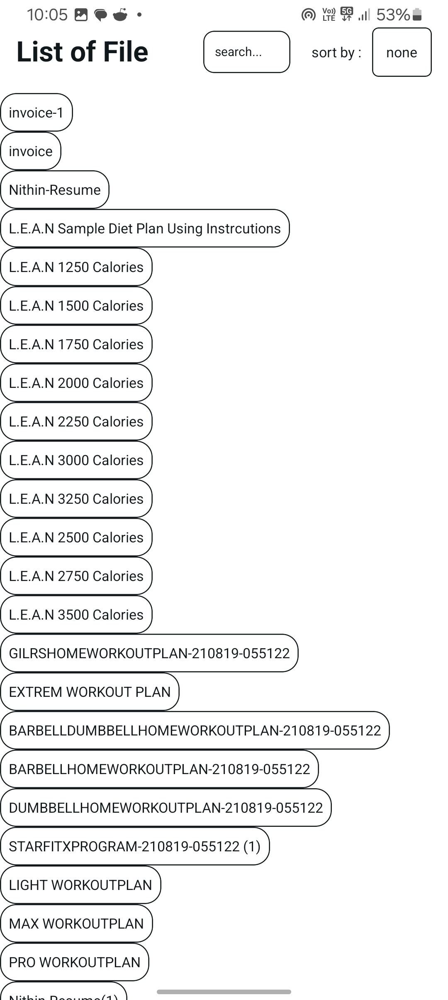
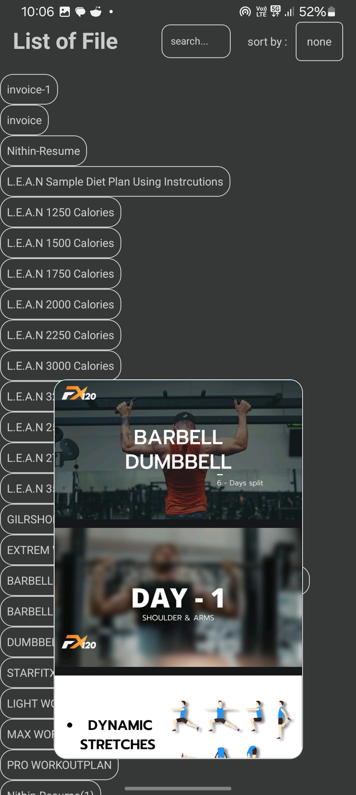
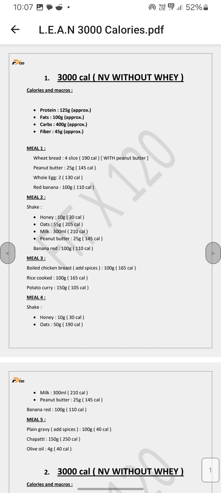
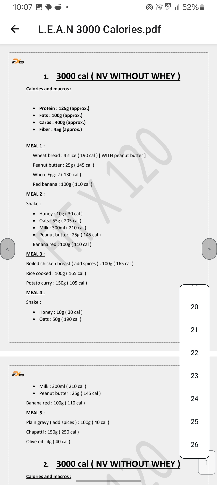

# PdFview

PdFview is an **Expo-based React Native app** designed to help you **read all PDF files on your device** efficiently. It requests permission to manage external storage (`android.permission.MANAGE_EXTERNAL_STORAGE`) on Android to access and display your PDFs. With fully custom-built UI components, PdFview provides a sleek mobile experience that supports both light and dark themes.

## Features

- **Comprehensive PDF Search**
  - Finds and lists **all PDF files** on your device using a BFS (Breadth-First Search) approach
  - Avoids hidden files, displaying only accessible PDFs

- **Powerful Navigation**
  - **Open PDFs directly in-app**
  - **Long press** any file in the list to preview its contents
  - Switch to the **next or previous PDF**
  - **Jump to a specific page** by tapping the page number

- **Intuitive File Management**
  - Search PDFs by name
  - **Sort files** by name, size, or modified time—ascending or descending

- **Permissions**
  - Requests `MANAGE_EXTERNAL_STORAGE` on Android for full device file access

- **Modern Mobile Theme**
  - Always uses light/dark theme based on your device settings
  - **All UI components are custom made** for PdFview

## Installation

```bash
git clone https://github.com/Nithin-3/PdFview.git
cd PdFview
pnpm install
```

## Running the app

> **PdFview is built with Expo.**  
To start the app, use:

```bash
pnpm start
```

This will start Expo and give you QR codes for easy testing on your device.

### Android Permissions

Make sure you provide storage permissions in your `AndriodManifest.xml` or manually on your device:

```xml
<uses-permission android:name="android.permission.MANAGE_EXTERNAL_STORAGE"/>
```

## Screenshots

<table>
  <tr>
    <td align="center"><br>Main File List (Dark)</td>
    <td align="center"><br>Main File List (Light)</td>
    <td align="center"><br>PDF Preview</td>
  </tr>
  <tr>
    <td align="center"><br>PDF Page (Dark)</td>
    <td align="center"><br>PDF Page (Light)</td>
    <td align="center"><br>Jump to Page</td>
  </tr>
</table>
